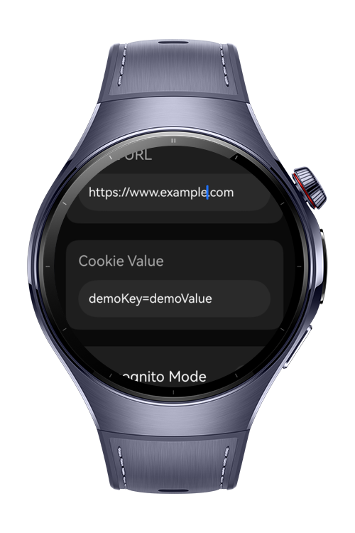
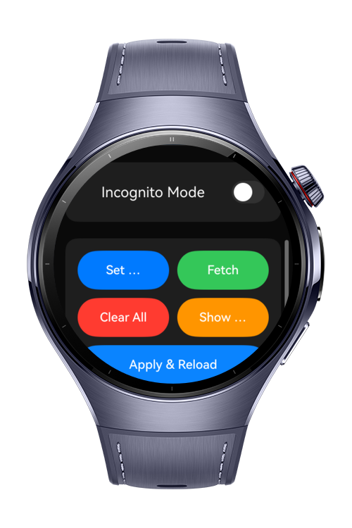

> **Note:** To access all shared projects, get information about environment setup, and view other guides, please visit [Explore-In-HMOS-Wearable Index](https://github.com/Explore-In-HMOS-Wearable/hmos-index).

# WebCookiePlayground

CookiePlaygroundWatch is a HarmonyOS demo app designed for Huawei Watch devices, enabling developers to experiment with WebView cookie behaviors.
The app features a modern watch-friendly UI and provides quick actions to set, fetch, clear, and apply cookies inside a WebView.

# Preview

<div>
  
  
</div>

# Use Cases

CookiePlaygroundWatch allows developers to:
- Set cookies using configCookieSync()
- Fetch cookies (normal or incognito mode) using fetchCookieSync()
- Clear all stored cookies with one tap
- Preview a live WebView and observe cookie changes instantly
- Inject JavaScript banners into loaded webpages to visually display document.cookie
- Reload the WebView automatically after applying cookies
- Test incognito vs normal mode behavior on HarmonyOS WebView
- 
This tool is ideal for testing WebView cookie policies, login state simulation, theme toggling via cookies, and debugging web-based watch apps.

# Tech Stack

- Languages: ArkTS
- Frameworks: HarmonyOS SDK 5.1.0 (API 18+)
- Tools: DevEco Studio 5.1.0.820
- Libraries:
- 
  @kit.ArkUI — UI components
  @kit.ArkWeb — WebView & CookieManager APIs
  @kit.BasicServicesKit — BusinessError handling

# Directory Structure

```
entry/src/main/ets/
|---pages
|   |---CookiePlaygroundWatch.ets         // Main page with cookie editor & WebView preview
|
|---kits
|   |---(None required; WebView APIs used directly)
|
|---resources
|   |---(Add screenshots or icons as needed)

``` 

# Constraints and Restrictions
## Supported Devices
Huawei Watch 5

## Limitations
- No multi-tab cookie isolation
- WebView height is restricted due to watch UI constraints
- Script injection may not work on CSP-restricted website

# LICENSE

WebCookiePlayground is distributed under the terms of the MIT License.  

See the [LICENSE](/LICENSE) for more information.
